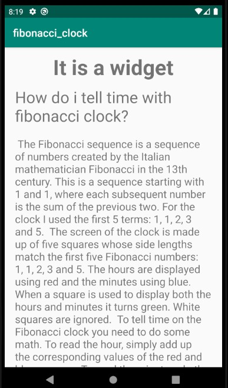
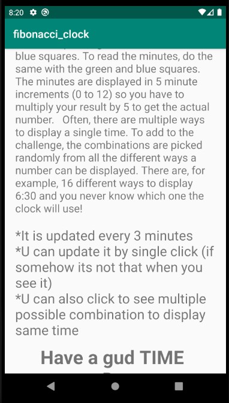
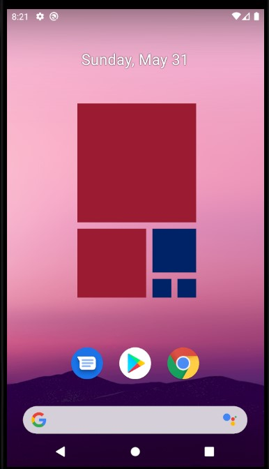

# Fibonacci Clock
Its a clock widget inspired from the fibonacci sequence.
## Main
      
## working clock
      

Same time can be shown in many different ways.
### PS: Colors can be changed :`)
